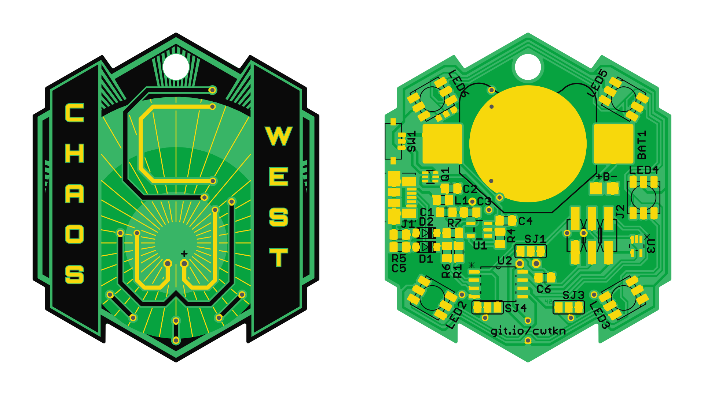
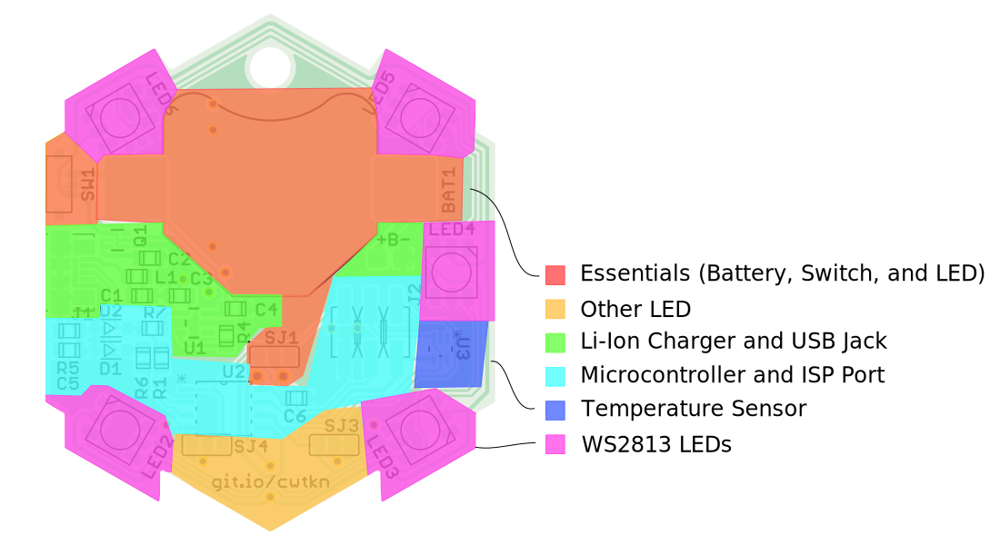
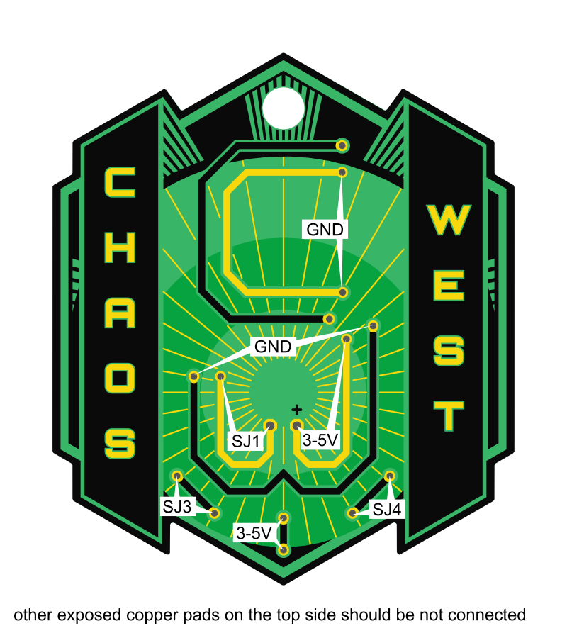

## Welcome

This is the official documentation of the Chaos-West Token which is given to anyone on the SHA2017 camp who supports us with a reasonable donation for us (mainly to be able to split-up costs we Chaos-West-villagers all share on the event). If you really want to have one of these wonderful and token kits, just come to our Chaos-West main tent on the event and support us with a recommended donation. In case there are some left-overs after the event, it should be somehow possible to receive these if you still want to get a token after the event. You'll find more information also in this documentation after SHA2017, the easiest would probably be to write an e-mail to cwtkn@devtal.de which should address the makers of this token. As this is a project released to the public domain, consolidating the thought of open hardware and free software, you can also produce the board by yourself (or wire up the rather simple circuit on a breadboard), but getting it from us really supports the collective activities of Chaos-West, just consider that.

## Quick Start

On SHA: Please come to me for flashing! Just plug in your token, and a flashing demo will be flashed.

Elsewise: type `make usbflash` to flash the token.

Attention: When powering the badge it will take about 6 seconds to boot, before anything will be shown (because of the USB firmware upgrade option).

## Package Contents

The token package should consist out of the following components. If something is missing, ask at the Chaos-West main tent for token support.

1. One Printed Circuit Board (PCB)
2. One Coin Cell Holder
3. One Effect-LED (probably you can choose between different ones)
2. Non-Rechargable CR2032 Coin Cell (3 V)
3. Printed Getting Started Guide
4. not mounted Power Switch (only first 100!)

Additionally there may be solderable pin needles and / or keyrings available.

If you want to extend your token with additional parts, there may be some ready sets of parts available where you got your token. Just check there first before you order these components. But beware that these are just limited (to about 20 to 25 sets), as this is only intended for those who really like to do some creative things on the event. You can buy all of the neccessary parts afterwards, refer to the part list below for order numbers given as a reference.

## Getting Started

**Warning**: There is no reverse-polarity protection, so be cautionous to insert the battery in the correct direction, the plus-sign of the battery always facing towards you when looking at the side of the PCB with the coin cell holder! If the battery is inserted in the wrong way, it probably will damage other parts of the circuit including the Front LED.

You should have received your token with an [quick start guide](docs/infocard.pdf). Follow the steps and you will get a basic functioning token which blinks when a coin cell is inserted (and optionally the switch is slide to the “On”-position. The steps of the printed getting started guide are noted here:

1. Solder the Coin-Cell holder. The slot should face the top.
2. Solder the Effect LED, mind the polarity (marked “+”) matches with your LED.
3. (Optionally) solder the switch. Cut the trace between the two pads more to the border of the token first, then solder the switch!
4. Insert the battery, (eventually switch on,) and enjoy the blinking / fading LED effects.

That's it basically. If you want more, read on, as there are many more possibilities in this little token PCB.

## Features

* Front LED lighting up
* Coin Cell Holder for CR2032 (standard) or LIR2032 (Li-Ion) Type Batteries
* Power Switch
* 8-bit Microcontroller with ISP-interface
* (Actually Precise) Temperature Sensor
* Up to Five WS2813 LEDs (and pads for extending to other WS281x-stripes, supporting the new WS2813 ones aswell)
* USB
* Li-Ion Charging Circuit (via USB)
* Microcontroller Firmware In-System-Programmable (ISP) or Directly Via USB

## Partlist

All parts, except from the thru-hole LED on the front are SMD-components, which means that their pins are soldered directly on the exposed pads of the PCB. Some of the components (Diodes, LEDs and ICs) need to be mounted in a specific direction. This direction can be seen on the drawing above. The mount-direction of the six-pin transistor Q1 is not important as the pinout is symmetric. Not all components are essential. Each build step below references the neccessary and optional parts for each step.

Part         | Value           | Description                                           | Farnell
------------ | --------------- | ----------------------------------------------------- | -------
BAT1         | Keystone 3002   | CR2032 / LIR2032 Coin Cell Holder (only use rechargable LIR2032 with Li-Ion Charger, never use CR2032)                     | 1650693
C1,2,5       | 10 nF           | 0805 Ceramic Capacitor (10V)                          | 1759246
C3,4         | 4.7 µF          | 0805 Ceramic Capacitor (10V)                          | 1759427
C6           | 100 nF          | 0805 Ceramic Capacitor (10V)                          | 9406387
D1,2         | 3.6 V Zener     | SOD-123 Zener Diode                                   | 2069437
J1           | Molex 47346     | Female Micro-USB Jack                                 | 1568026
J2           | 2,54mm header   | 6-pin ISP Header (2x3 pins)                           | 2505049
L1           | 33 Ohm @ 10MHz  | 0805 Ferrite Bead                                     | 1800367
LED1         | Standard        | Various different LEDs1                    | 1581189
LED2,3,4,5,6 | WS2813          | RGB-LED with integrated controller                    | -2
Q1           | Si1967DH        | SOT-363 Dual P-Channel MOSFET                         | 2335282
R1,6         | 68 Ohm          | 0805 Chip Resistor                                    | 2447707
R4           | 47 kOhm         | 0805 Chip Resistor                                    | 2447664
R5           | 1 MOhm          | 0805 Chip Resistor                                    | 2447596
R7           | 2.2 kOhm        | 0805 Chip Resistor                                    | 2447623
SJ1,3,4      | -               | either short or current limiting resistor1 | 2447606
SW1          | ALPS SSAJ120100 | SPDT Switch                                           | 2056803
U1           | MCP7383xT-2ACI  | Single-Cell Li-Ion Charging IC                        | 1332158
U2           | ATtiny85-20SU   | SOIC-8 20 MHz AVR Microcontroller                     | 1972176
U3           | MCP9700AT-E/LT  | SC70-5 Temperature Sensor                             | 1332165

1: For LED1 many options are available (including Effect-LEDs and standard one- and multicolor LEDs). This also results in different possible usages of the solder-jumpers SJ1,3 and 4. Check the specific section "Front LED" for this. 
2: The WS2813 LEDs are not yet commonly available. Check for example TME, eBay or AliExpress for these.

### Testpads

There are a few additional pads which are meant for additional features not included in the default version of this board. See this short reference as the full description of these and refer to the schematic for reference.

Pads      | Description
--------- | -----------
+B-       | On these pads an Lithium-Polymer single cell could be soldered when not using the coin-cell holder. When not using the Li-Ion Charger circuit, these pads can generally be used to supply about 2.4 to 5 volts to the board.
DO,BO,GND | These are located beneath LED6 (DO outermost, following BO, and GND most to the center of the board) and are for chaining additional WS281x-LEDs to the board. BO is only used for WS2813 whereas DO is the standard WS281x-signal output of the last on-board WS2813-LED LED6.

## Build

The full feature-set of the token can be only achieved when soldering extensions and doing very small modifications to the board. This section gives an overview about which modification “checkpoints” can be reached at which each more and more features are achieved, yet ranging from very simple one-part soldering jobs up to own modifications on a microcontroller firmware involving even USB-development.

### Essentials

Components: BAT1, LED1

When receiving your token, you will find an Effect LED and coin cell holder with your kit. This is enough to start with a very simple circuit: The LED is connected directly to the battery terminals and thus is lit whenever a coin cell with a sufficiently high voltage is inserted.

Any other part of the circuit (like a power switch, the microcontroller, or a current limiting resistor for the LED) is by default bypassed, which means that some of the pads of the LED solder jumper (SJ1) and the switch (SW1) are interconnected with small traces. If for example the effect LED is exchanged with a standard non-blinking LED, a current limiting resistor is necessary, which means that a small trace between two of the pads of SJ1 must be cut and a sufficiently large-valued (e.g. 220 ohms) resistor soldered there instead.

### Power Switch and Other LED

Components: SW1, SJ3, SJ4

The power switch is also by default bypassed, which makes it necessary to cut traces on the switches pads when it is desired to have a more comfortable way to switch on and off the blinking LED than with removing and inserting the coin cell. But: The switch has three pins which are all by default connected together. Not both interconnected traces need necessarily to be cut for this step. The following table shows, which of these needs to be cut for which build state (the pins numbered from 1 to 3 starting from left to right when SW1 can be read the correct way).

Cut Trace    | Power Switch | USB MOSFET | Description
------------ | ------------ | ---------- | -----------
nothing cut  | no           | no         | always on (without USB)
1-2 cut only | no           | yes        | no power switch is soldered, but the USB parts are soldered (always on with USB, doesn't make much sense)
2-3 cut only | yes          | no         | only the power switch is used, and no USB parts are soldered (switched without USB)
both cut     | yes          | yes        | both power switch and USB components are soldered (switched with USB)

Similar to the main LED (see above), SJ3 and SJ4 allow at least two more random LEDs to be soldered on the front side of the board. Usually the SJ-pads will be connected to the cathode of the LEDs except for one case: common cathode multi-color LEDs. But this will be topic of a following section. This means, that the anode of the LEDs should be connected to one of the 3-5 V (VCC) pads and the cathode (preferably) to the middle pads of SJ1,3,4 which are with vias in the logo brought to the front side. The same as for the main LED has taken into account here: If the LED is blinking, it usually doesn't require a current limiting resistor. If it is a standard (maybe multicolor or RGB) LED, then a current limiting resistor is strictly required, missing resistors causing damage to the LED.

### Li-Ion Charger and USB Jack

TODO

Never use the charging circuit for normal CR2032 coin cells. If you solder, you can only use single Li-Ion Cells in the coin cell holder or on the exposed battery pads (for larger battery packs).

R4: for greater Li-Ion Cells can be other (330mAh: 4k works), charging-rate originally set for smaller LIR2032 (about 20mAh). Refer to the MCP7383 datasheet for more details on this “Program” resistor.

R7: This from the schematic is connected between USB-DM and +5V, but it must be connected between USB-DM and VCC. Otherwise it _won't boot_ when a bootloader is flashed on the Microcontroller and run from the battery. So it is neccessary to solder only the USB-DM pad of R7 to the resistor and leave the other side of the resistor in the air and then solder some copper wire between this and a VCC pad.

### Microcontroller and ISP Port

TODO

When using the bootloader, keep in mind that R7 needs to be bodge-wired (see topic “Li-Ion Charger and USB Jack”.

### Temperature Sensor

The MCP9700AT-E/LT temperature sensor has an range of -40°C to 125°C with a maximum tolerance of ±2°C tolerance. If it is cali
brated at 25°C, a tolerance of ±1°C can be achieved. It is connected to pin PB2 and can be read out using the Analog/Digital-Converter channel 1 (ADC1).

### WS2813 LEDs

There are footprints on the board for up to five WS2813-type LEDs. These integrate a full-color RGB-PWM generator and 24-bit shift register logic which allows to chain this kind of LEDs to a long chain which is controlled by a single pin.

## Front LED

### Options
* Single Color (red, amber, yellow, green, blue, pink, white, UV, IR) Standard LED
* Common-Anode RGB-LED
* Common-Cathode RGB-LED
* Disco Effect LED
* Slow-Fading Effect LED
* Blinking LED
* [WS2812 Thru-Hole LED](https://www.adafruit.com/product/1938)
* ... possibly any 10/5/3mm Thru-Hole LED one could think of

In any case, the status of the LED can be controlled by the microcontroller, if it is fitted and the solder jumpers are set correctly.

## USB

The USB jack can be used to charge the Li-Ion battery or to exchange data between an USB-host and the microcontroller on the token. With a special bootloader, it is also possible to flash the microcontroller firmware directly over the USB-port, so there is really nothing more than a standard USB-port on a PC needed to start developing own programs and flashing them to the token. An ISP-type-programmer is then only necessary for programming the bootloader into the microcontroller for the very first time.

### Bootloader
[micronucleus](https://github.com/micronucleus/micronucleus)

To write the Bootloader, connect via ISP port (or SO-8 clamp directly on the AtTiny).

_Important_: It is neccessary to flash without the temperature sensor, as it would override the clock pin of the ISP process.

Flash the Bootloader (micronucleus default build for ATTiny85 or Digispark) with the following commands:

1. `cd firmware`
2. `make flash fuse` (only continue if successfully and connectable via USB; DigiSpark Driver)
3. `make disablereset` (this _disables_ the Reset functionality and won't allow you to flash the ATTiny85 again via ISP. After this fusing it is only possible via HVSP to rescue a wrongly flashed ATTiny85).

When using the bootloader, keep in mind that R7 needs to be bodge-wired (see topic “Li-Ion Charger and USB Jack”.

## Firmware

`make usbflash` should be enough to flash to a token with installed micronucleus bootloader.